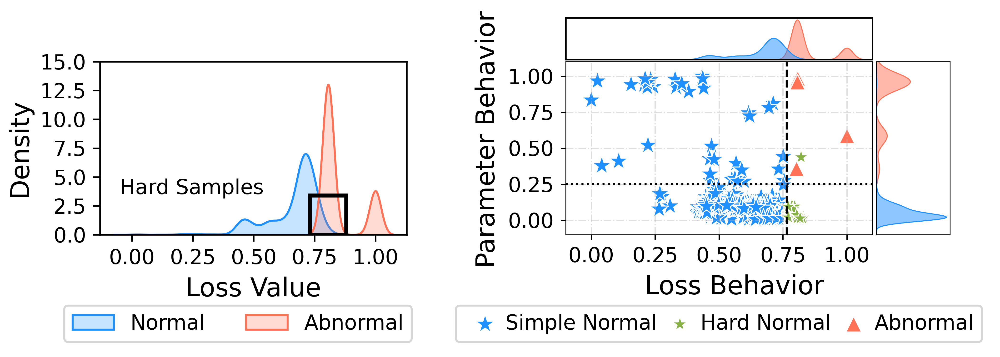
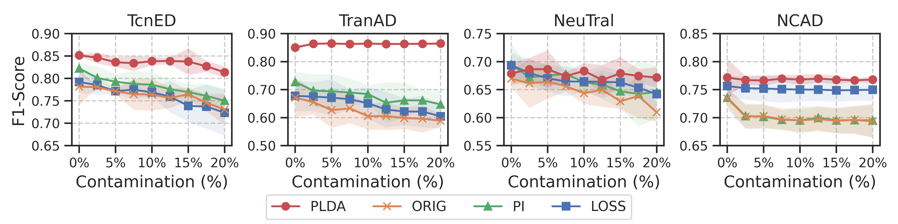
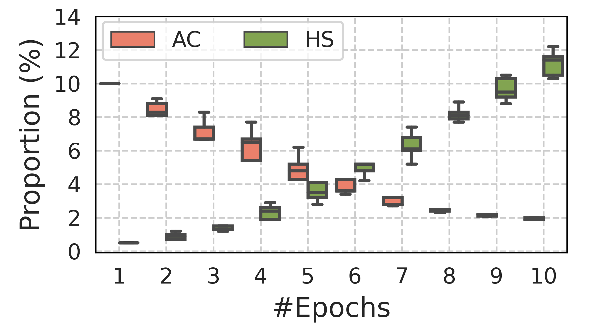
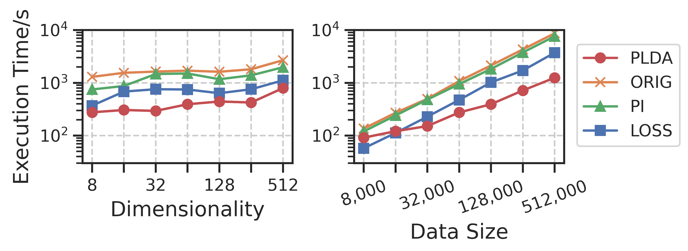
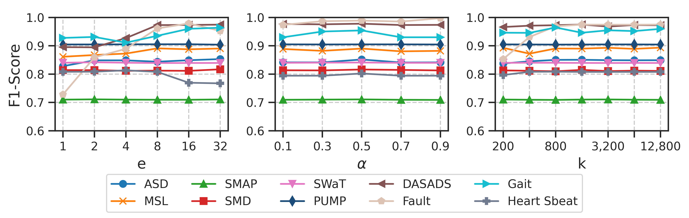
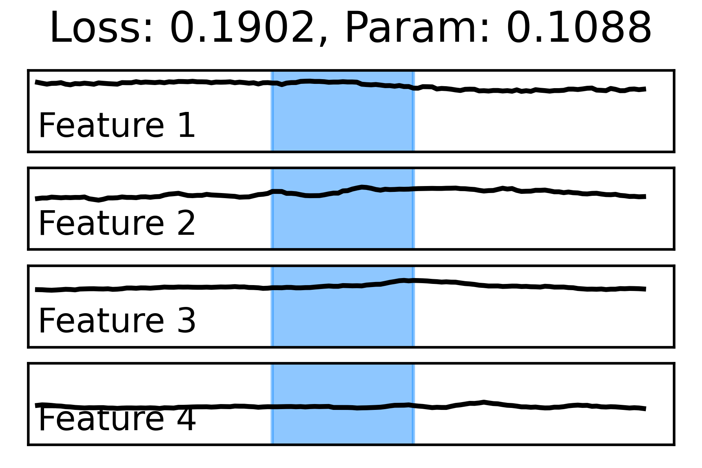
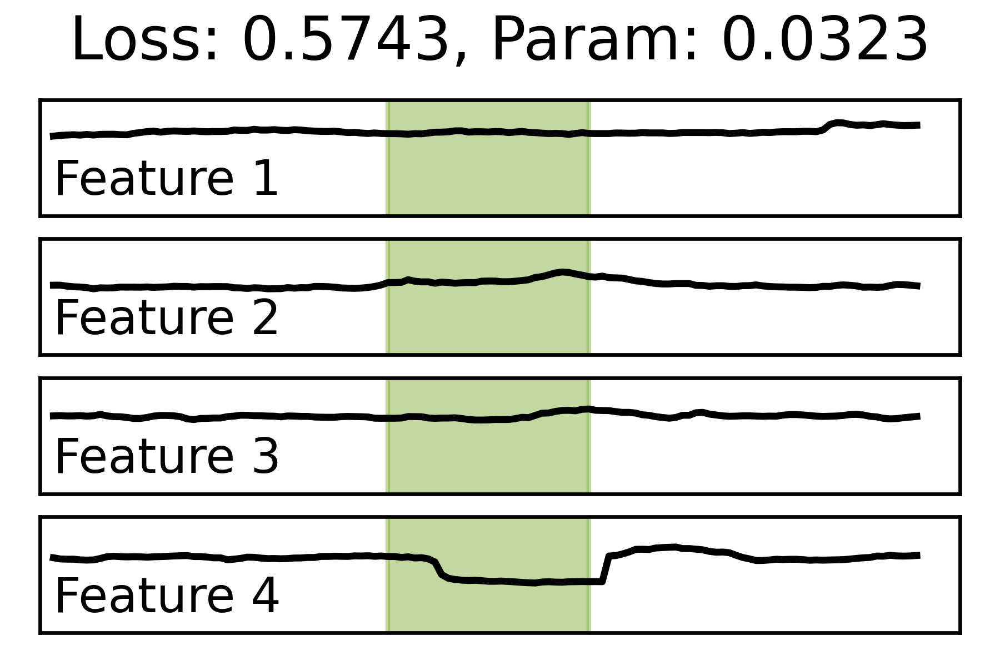
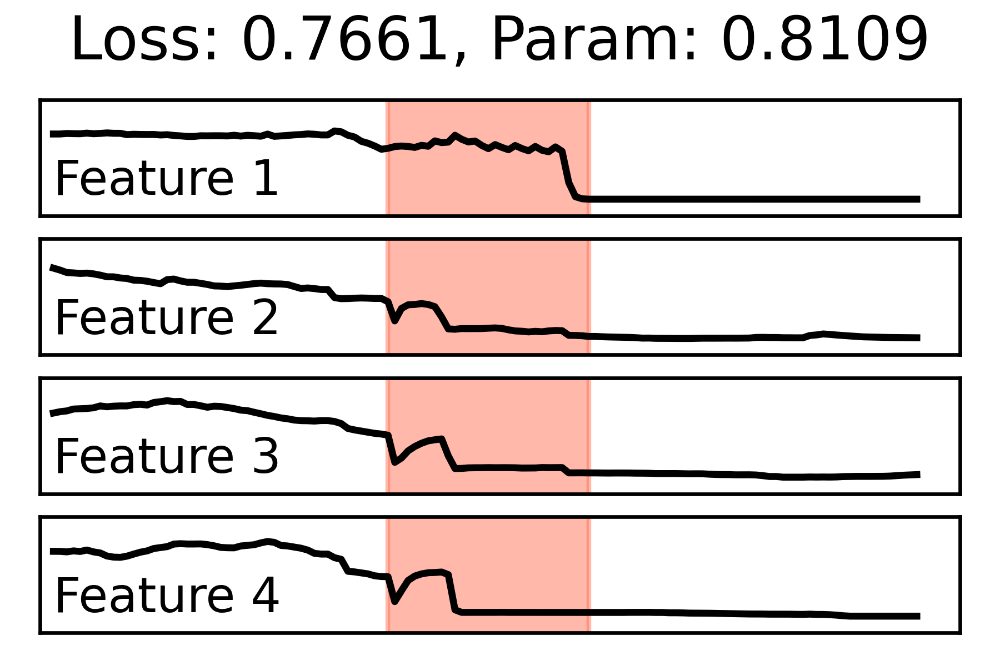

## Specification of dependencies.
The specification of dependencies is shown in `requirements.txt`.


## Training code and evaluation code.

Use `runPLDA.py` for training and evaluation. 
You can set the experimental dataset and the base TSAD model through the following code:

```python
    func = 'PLDA'
    args.sample_selection = func_list[func]     # Data Argumentation Methods
    args.dataset = 'PUMP'                       # Dataset name
    args.model = 'TcnED'                        # Benchmark Unsupervised Deep TSAD Models
    args.insert_outlier = 1                     # 0: insert anomaly contamination，1:do not insert
    args.rate = 10                              # Contamination rate 10%
```

The results are recorded in the path "./@records"

## Results tables and figures.
The experimental results are located in the path "./plotsource".

Use functions in `plot.py` to plot the following figures.

```python
plot_distribution()
```




```python
plot_pollute()
```


```python
plot_fill_samples()
```
  


```python
plot_scalability()
```



```python
plot_hyparam()
```


```python
plot_case_study()
```

  
  

